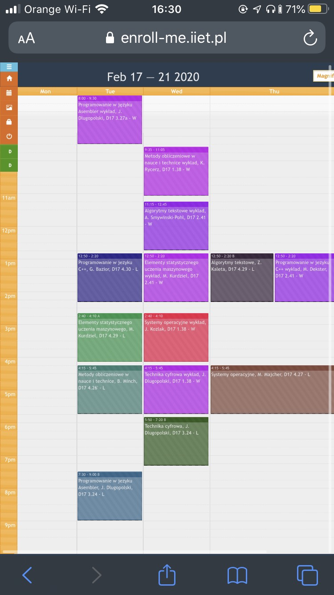
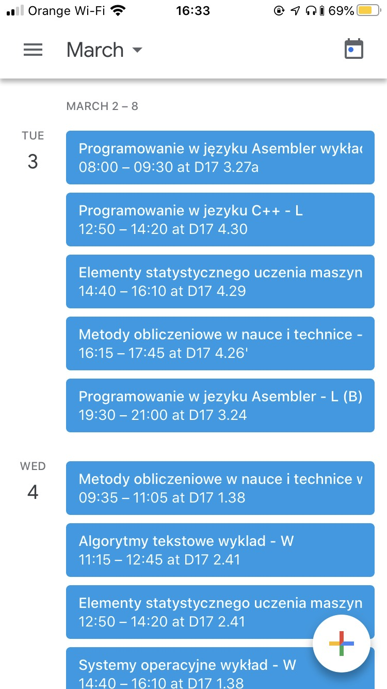
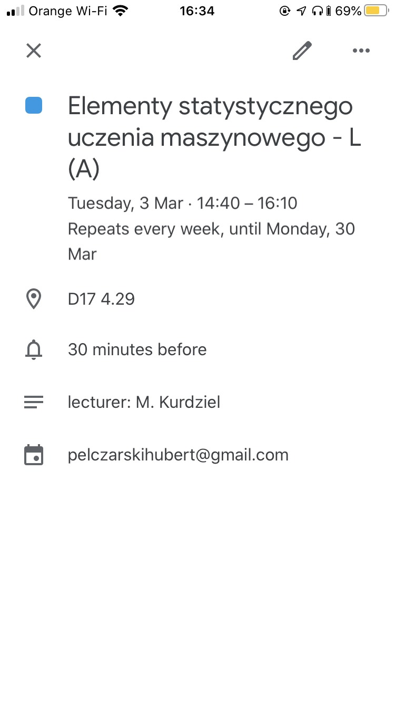

# enroll-calendar
&nbsp;

Convert enroll-me.iiet.pl schedules to google calendar for CS IET students
##### enroll-calendar will soon be available on pip servers
---
### Content
##### 1. Features
##### 2. Disadvantages
##### 3. Requirements
##### 4. Installation
##### 5. Usage
##### 6. Screenshots
##### 7. TODO
---
### Features
* convert enroll plan to google calendar
* add overdue classes from last year to the same plan
* remove classes which don't interest you
* remove all lectures from plan at once (SKIP GANG)
---
### Disadvantages
* may not work if you have more than 3 classes at the same hour in the same day
* no colors for classes (yet)
* weeks A/B constantly change therefore they happen weekly on google calendar
* #### Not tested on google chrome
---
### Requirements
* python 3.8>=
* requirements.txt
* firefox with geckodriver(recommended) or google chrome with webdriver
* google-calendar-api-enabled google account
* google-calendar credentials in google_credentials directory
---
### Installation
* ```git clone https://github.com/hoob3rt/enroll-calendar.git```
* ```sudo pip install -r requirements.txt ```
* install geckodriver for firefox [here](https://github.com/mozilla/geckodriver/releases)
    * if you are on arch linux simply run ```yay -S geckodriver```
* alternatively install webdriver for chrome [here](https://chromedriver.chromium.org/downloads)
    * if you are on arch linux simply run ```yay -S webdriver```
* enable google-calendar-api for your account & download credentials.json
  [explained in the first 2 steps here](https://dev.to/megazear7/google-calendar-api-integration-made-easy-2a68)
* place credentials.json in google_credentials directory
---
### Usage
run ```python enroll-calendar/convert_plan.py```
available cl arguments:
````
usage: convert_plan.py [-h] [-t TIMEOUT] [-u USERNAME] [-d DRIVER] [-s START_DATE] [-e END_DATE] [-dr]

Convert enroll plan to google calendar

optional arguments:
  -h, --help            show this help message and exit
  -t TIMEOUT, --timeout TIMEOUT
                        timeout for fetches, set hight value with slower connections (default: 5)
  -u USERNAME, --username USERNAME
                        provide enroll username before running script
  -d DRIVER, --driver DRIVER
                        choose driver before running script (available values: chrome, firefox)
  -s START_DATE, --start-date START_DATE
                        choose start_date before running script (format: YYYY-MM-DD)
  -e END_DATE, --end-date END_DATE
                        choose end_date before running script (format: YYYY-MM-DD)
  -dr, --dry-run        run script without convertion

````
---
### Screenshots
Default enroll view             |  General View         | Detailed View
:-------------------------:|:-------------------------:|:--------:
  |   | 
---
### TODO
* test on google chrome with webdriver
* add different colors for classes
